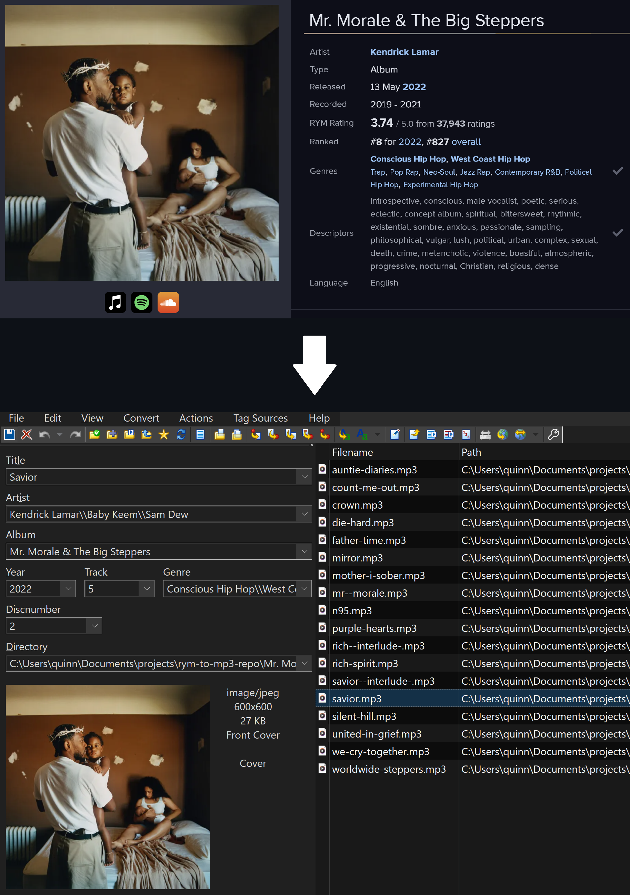

    

# RYM to MP3

This tool uses [rateyourmusic.com](https://rateyourmusic.com/) and its included YouTube and SoundCloud media links to **download music with all the correct MP3 metadata**. RYM is a music database site with a vast amount of **unreleased music** that isn't on traditional streaming services, so this script is **optimized for uploading to Spotify as local files**. All of this can be done simply by **running one command with a RYM URL as an argument**, see below. This script works for **singles, mixtapes, EPs, albums, etc.** as long as it has a YouTube or SoundCloud media link.

SoundCloud is preferred as tracks are already cropped into individual tracks, and YouTube uploads are usually uploaded as one full 40-some-minute long video for the entire album.
However, if SoundCloud is not an option, this script will take the track lengths from RYM and crop a full YouTube video into individual tracks.

## Installation

Make sure Python>3.8 and pip are installed.

Install [ffmpeg](https://github.com/kkroening/ffmpeg-python?tab=readme-ov-file#installing-ffmpeg). I recommend using one of the packages and executables and they will often come with an `libmp3lame` installation - we'll need that to encode the files correctly. Ensure you have `ffmpeg` installed and added to your PATH and that you have `libmp3lame` installed.

Run `pip install rym-to-mp3`.

Then, just run `r2m {rym link}`.

(`{rym link}` is the link to the RYM page with the music you want to download, e.g. `https://rateyourmusic.com/release/album/earl-sweatshirt-the-alchemist/voir-dire/` or `https://rateyourmusic.com/release/single/billy-woods/body-of-work/`)

Wait for the script to fully finish, and your downloaded tracks with all the metadata can be found in the folder in the root directory with the name of the album. If it ends up using YouTube, it'll also leave you the full YouTube download as "fullAudio.mp3." Enjoy!

## Additional Options

This script prefers SoundCloud by default, then YouTube if SoundCloud fails. Adding `-y` will prefer YouTube, then if that fails, use SoundCloud.

This script rejects YouTube as an option if the RYM album length and YouTube video differ by more than 2 seconds. To ignore this, add `-i` to your command.

For example, if I wanted to prefer YouTube and ignore this album length discrepancy check, I would run

`r2m {rym link} -y -i`

You can also specify your own links, if you want. Use at your own risk. You can use `-u` to supply a YouTube link and `-s` to supply a SoundCloud link.

`r2m {rym link} -y -i -u {YouTube link}`
"I want to prioritize YouTube over SoundCloud, ignore any album length discrepancy, and I want to use my own supplied YouTube link instead of the one on RYM (or in place of it if there isn't one)"

Not only that, it's also possible to provide custom timestamps for a YouTube video. The idea here is that you could find a YouTube video that has slightly different cropping or track spacing, which would otherwise fail to be cropped correctly. If you can find the correct timestamps (in the comments, description, etc.) you can inject those instead.

You can actually just copy-paste a full comment without parsing the timestamps yourself. For example, if you had a comment that said

<blockquote>
@apolosteez47 
11 months ago (edited) 
Tracklist For All Phone Users 
 
(0:00) - 1. United In Grief 
(4:14) - 2. N95 
(7:30) - 3. Worldwide Steppers 
(10:54) - 4. Die Hard ft. Blxst & Amanda Reifer 
(14:53) - 5. Father Time ft. Sampha 
(18:35) - 6. Rich(Interlude) 
(20:20) - 7. Rich Spirit 
(23:40) - 8. We Cry Together ft. Taylor Paige 
(29:09) - 9. Purple Hearts ft. Summer Walker & Ghostface Killah 
(34:36) - 10. Count Me Out 
(39:19) - 11. Crown 
(43:43) - 12. Silent Hill ft. Kodak Black 
(47:24) - 13. Savior(Interlude) 
(49:56) - 14. Savior ft. Baby Keem & Sam Dew 
(53:41) - 15. Auntie Diaries 
(58:22) - 16. Mr. Morale ft. Tanna Leone 
(1:01:52) - 17. Mother I Sober ft. Beth Gibbons 
(1:08:39) - 18. Mirror 
</blockquote>
 
You can just post that full comment in a string input with `-t` and the program will use regex to parse anything that looks like a timestamp. As always, use at your own risk.

## Splitting

When using a YouTube media link, a full album will be downloaded and then split into individual tracks, using either the parsed timestamps or custom timestamps if specified. I extracted this logic so that you can use it by itself with any .mp3 file. For example:

`r2m "bigAlbum.mp3" -x -t "0:30 0:45 1:30 2:30"`

`-x` specifies that you want to split, and it requires you to use the `-t` option to supply timestamps - this splitting is completely independent of RYM, so you need to tell it where the breaks are. Metadata, if present, is copied from the original file to the output files.

Output files are dumped into a directory with the same name as the file you passed in.

## Specs

This supports the following metadata:

-   Title
-   Artist(s)
    -   Including featured artists on individual tracks
-   Album
-   Year
-   Genre(s)
-   Track number
-   Disc number
-   Album cover

It uses LAME MP3 encoding because Spotify prefers it.
